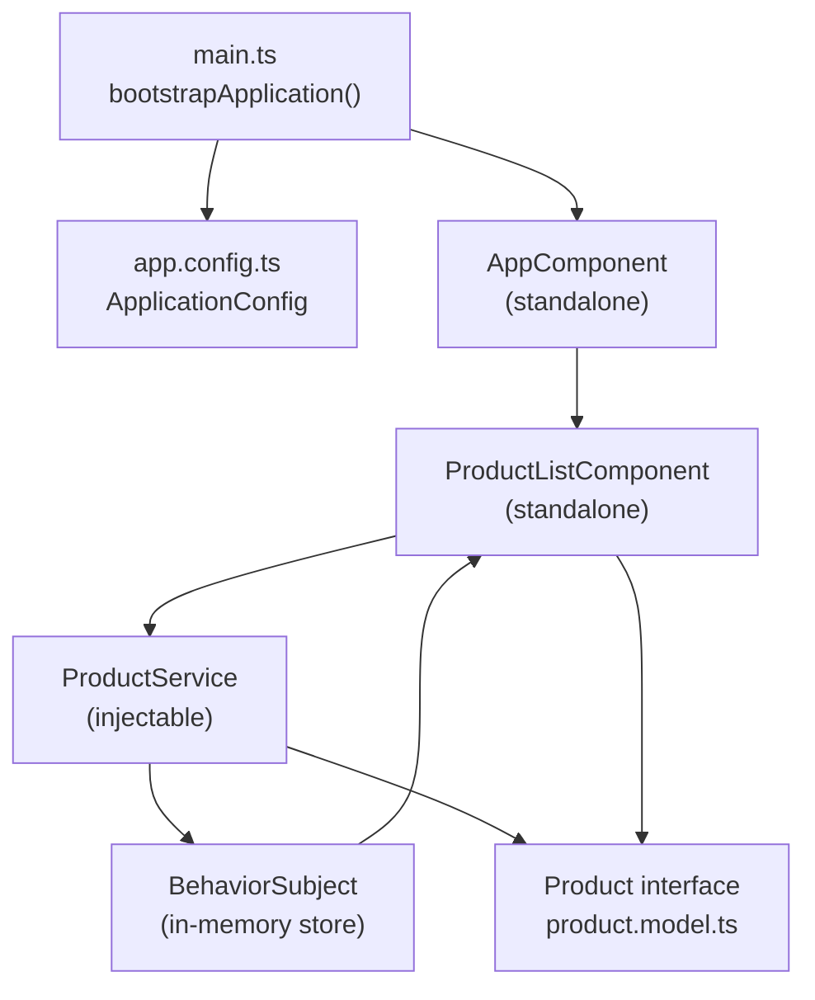

# Design Document: Angular Product CRUD

## Overview

This document describes the technical design for a standalone Angular application that provides full CRUD (Create, Read, Update, Delete) management of a product catalog. The application uses Angular 17+ standalone components, reactive state management via RxJS `BehaviorSubject`, and in-memory data storage. There is no backend, no routing, and no external dependencies beyond Angular and RxJS.

The application presents a single-page product list with search/filter, a statistics summary, and a modal form for creating and editing products. Delete operations require a confirmation step.

### Key Design Decisions

- **Standalone components** — No `NgModule` is used. All components are declared with `standalone: true` and import their own dependencies.
- **In-memory reactive store** — A `BehaviorSubject<Product[]>` in `ProductService` acts as the single source of truth. All mutations go through the service, and all reads subscribe to the observable.
- **No routing** — The application has a single view. `app.routes.ts` exports an empty array.
- **Modal as component state** — The modal form is rendered inline in `ProductListComponent` and toggled via a boolean flag, avoiding the need for a dialog service or CDK overlay.

---

## Architecture

The application follows a simple two-layer architecture: a service layer for data management and a presentation layer for rendering.



### Data Flow

1. `ProductService` initialises the `BehaviorSubject` with sample data.
2. `ProductListComponent` subscribes to `getProducts()` on init and stores the emitted array in a local `products` signal or property.
3. User actions (add, edit, delete, search) call service methods or update local component state.
4. After any mutation, the service calls `this.productsSubject.next(updatedArray)`, which triggers re-emission to all subscribers.
5. The component re-renders the table and statistics automatically.

---

## Components and Interfaces

### File Structure

```
src/
├── main.ts
├── index.html
└── app/
    ├── app.component.ts
    ├── app.config.ts
    ├── app.routes.ts
    ├── models/
    │   └── product.model.ts
    ├── services/
    │   └── product.service.ts
    └── components/
        └── product-list/
            ├── product-list.component.ts
            ├── product-list.component.html
            └── product-list.component.css
```

### AppComponent

- Selector: `app-root`
- Standalone: `true`
- Imports: `ProductListComponent`
- Template: renders `<app-product-list>`
- Bootstrapped from `main.ts` via `bootstrapApplication(AppComponent, appConfig)`

### ProductListComponent

- Selector: `app-product-list`
- Standalone: `true`
- Imports: `CommonModule`, `FormsModule`
- Responsibilities:
  - Subscribe to `ProductService.getProducts()` and maintain a local `filteredProducts` array
  - Render the product table
  - Manage search query state and apply client-side filtering
  - Toggle the modal form open/closed
  - Hold the `editingProduct` reference (null for create, Product for edit)
  - Call service methods on form submission and delete confirmation
  - Compute and display statistics

**Key component properties:**

| Property | Type | Purpose |
|---|---|---|
| `products` | `Product[]` | Full list from service subscription |
| `filteredProducts` | `Product[]` | Filtered subset shown in table |
| `searchQuery` | `string` | Bound to search input |
| `showModal` | `boolean` | Controls modal visibility |
| `editingProduct` | `Product \| null` | null = create mode, Product = edit mode |
| `formData` | `Partial<Product>` | Bound to modal form fields |
| `showDeleteConfirm` | `boolean` | Controls delete confirmation dialog |
| `productToDelete` | `number \| null` | Id of product pending deletion |
| `formErrors` | `string[]` | Validation error messages |

**Key component methods:**

| Method | Description |
|---|---|
| `ngOnInit()` | Subscribe to product observable |
| `onSearch()` | Filter `products` by `searchQuery` |
| `openAddModal()` | Reset `formData`, set `editingProduct = null`, show modal |
| `openEditModal(product)` | Copy product into `formData`, set `editingProduct`, show modal |
| `closeModal()` | Hide modal, clear `formData` and errors |
| `submitForm()` | Validate, call add or update on service, close modal |
| `confirmDelete(id)` | Set `productToDelete`, show confirmation |
| `executeDelete()` | Call `deleteProduct`, hide confirmation |
| `cancelDelete()` | Clear `productToDelete`, hide confirmation |
| `getStatistics()` | Compute total, inStock, outOfStock, avgPrice from `products` |

### ProductService

- Provided in: `root`
- Responsibilities: own the `BehaviorSubject`, expose observable and CRUD methods

**Public API:**

| Method | Signature | Description |
|---|---|---|
| `getProducts` | `() => Observable<Product[]>` | Returns the observable stream |
| `getProductById` | `(id: number) => Product \| undefined` | Synchronous lookup |
| `addProduct` | `(product: Omit<Product, 'id'>) => void` | Assigns id, appends, emits |
| `updateProduct` | `(product: Product) => void` | Replaces by id, emits |
| `deleteProduct` | `(id: number) => void` | Removes by id, emits |
| `searchProducts` | `(query: string) => Product[]` | Synchronous filter (used internally) |

---

## Data Models

### Product Interface

```typescript
// src/app/models/product.model.ts
export interface Product {
  id: number;
  name: string;
  price: number;
  description: string;
  category: string;
  inStock: boolean;
}
```

### Sample Data

The service initialises with three products:

```typescript
const SAMPLE_DATA: Product[] = [
  { id: 1, name: 'Laptop',     price: 999.99,  description: 'High-performance laptop', category: 'Electronics', inStock: true  },
  { id: 2, name: 'Coffee Mug', price: 12.99,   description: 'Ceramic coffee mug',       category: 'Kitchen',     inStock: true  },
  { id: 3, name: 'Notebook',   price: 4.99,    description: 'Spiral-bound notebook',    category: 'Stationery',  inStock: false },
];
```

### Statistics Model (computed, not stored)

```typescript
interface ProductStatistics {
  total: number;
  inStock: number;
  outOfStock: number;
  averagePrice: number; // rounded to 2 decimal places
}
```

### Form Data Shape

The modal form binds to a `Partial<Product>` object. On submission, required fields are validated before calling the service. The `id` field is omitted for create operations and included for edit operations.

---

## Correctness Properties

*A property is a characteristic or behavior that should hold true across all valid executions of a system — essentially, a formal statement about what the system should do. Properties serve as the bridge between human-readable specifications and machine-verifiable correctness guarantees.*

### Property 1: Product round-trip identity

*For any* valid product object (with all required fields), adding it to the store and then retrieving it by the assigned id should return a product with the same field values (name, price, description, category, inStock).

**Validates: Requirements 2.6, 2.4**

### Property 2: Delete removes exactly one product

*For any* product store state and any existing product id, calling `deleteProduct(id)` should result in a store that contains exactly one fewer product and no product with that id.

**Validates: Requirements 2.8, 2.11**

### Property 3: Update preserves store size

*For any* product store state and any existing product id, calling `updateProduct` with a modified version of that product should result in a store of the same size where the product at that id reflects the new values.

**Validates: Requirements 2.7, 2.11**

### Property 4: Search is a subset filter

*For any* non-empty search query, the result of `searchProducts(query)` should be a subset of the full product list, and every returned product's name or category should contain the query string (case-insensitive).

**Validates: Requirements 2.9**

### Property 5: Empty search returns all products

*For any* product store state, calling `searchProducts('')` should return all products in the store.

**Validates: Requirements 2.10**

### Property 6: Statistics are consistent with store

*For any* product store state, the computed statistics (total, inStock, outOfStock, averagePrice) should be mathematically consistent with the product array: `total = inStock + outOfStock`, `averagePrice = sum(prices) / total` (rounded to 2 dp), and `inStock + outOfStock = total`.

**Validates: Requirements 8.1, 8.2, 8.3, 8.4**

### Property 7: Unique id assignment on add

*For any* product store state, after calling `addProduct`, the newly added product should have an id that does not collide with any pre-existing product id in the store.

**Validates: Requirements 2.6**

### Property 8: Whitespace-only form fields are invalid

*For any* form submission where any required field (name, price, category, description) consists entirely of whitespace or is empty, the submission should be rejected and the store should remain unchanged.

**Validates: Requirements 5.3, 5.5, 6.4**

---

## Error Handling

### Form Validation

- Required fields: `name`, `price`, `category`, `description`
- `price` must be a positive number
- Validation runs on submit (not on every keystroke)
- Errors are collected into a `formErrors: string[]` array and displayed above the submit button
- The service is never called if validation fails

### Service Edge Cases

| Scenario | Behaviour |
|---|---|
| `getProductById` with unknown id | Returns `undefined`; component should guard before using the result |
| `updateProduct` with unknown id | No-op; the filter finds no match and the array is unchanged |
| `deleteProduct` with unknown id | No-op; the filter finds no match and the array is unchanged |
| `addProduct` with duplicate name | Allowed; uniqueness is not enforced (id uniqueness is enforced) |

### Observable Subscription

- `ProductListComponent` stores the subscription and calls `unsubscribe()` in `ngOnDestroy` to prevent memory leaks.

---

## Testing Strategy

### Unit Tests

Unit tests cover specific examples and edge cases for the service and component logic.

**ProductService unit tests:**
- Pre-loaded sample data contains exactly three products
- `getProductById` returns the correct product for a known id
- `getProductById` returns `undefined` for an unknown id
- `addProduct` increases the store length by one
- `updateProduct` changes the correct fields without affecting other products
- `deleteProduct` removes the correct product
- `searchProducts('')` returns all products
- `searchProducts('laptop')` returns only matching products (case-insensitive)

**ProductListComponent unit tests:**
- Renders a row for each product
- Displays "no products" message when list is empty
- Opens modal in create mode when "Add Product" is clicked
- Opens modal in edit mode pre-filled when "Edit" is clicked
- Calls `deleteProduct` after delete confirmation
- Does not call `deleteProduct` when delete is cancelled
- Statistics section shows correct values

### Property-Based Tests

Property-based tests use [fast-check](https://github.com/dubzzz/fast-check) (TypeScript/JavaScript PBT library) and are configured to run a minimum of 100 iterations per property.

Each test is tagged with a comment in the format:
`// Feature: angular-product-crud, Property N: <property_text>`

**Property tests to implement:**

| Property | Test description |
|---|---|
| Property 1 | Generate arbitrary valid products, add them, retrieve by id, assert field equality |
| Property 2 | Generate arbitrary store states and a valid id, delete, assert size decreases by 1 and id absent |
| Property 3 | Generate arbitrary store states and a valid id, update with new values, assert size unchanged and values updated |
| Property 4 | Generate arbitrary non-empty queries, assert all results contain the query in name or category |
| Property 5 | Generate arbitrary store states, assert `searchProducts('')` length equals store length |
| Property 6 | Generate arbitrary store states, assert statistics invariants hold |
| Property 7 | Generate arbitrary sequences of `addProduct` calls, assert all ids are unique |
| Property 8 | Generate whitespace-only strings for required fields, assert form validation rejects them |

### Integration / Smoke Tests

- Application bootstraps without errors (smoke test)
- `ProductListComponent` renders inside `AppComponent` (integration test)
